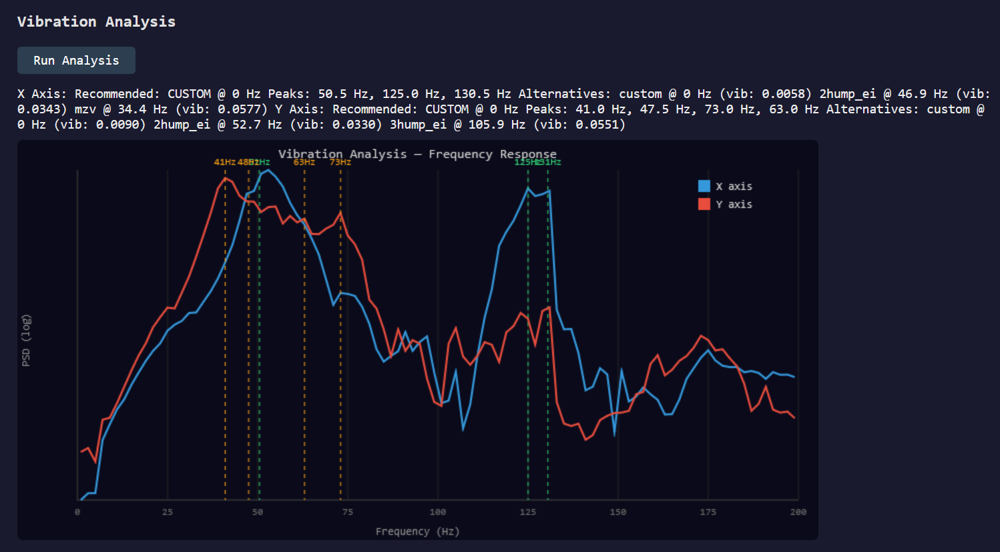
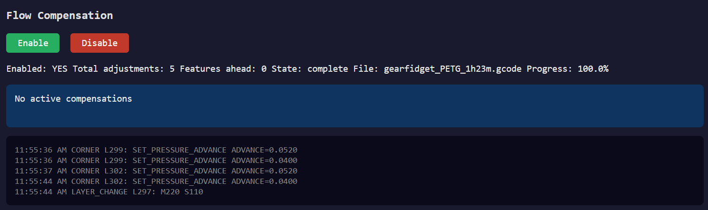
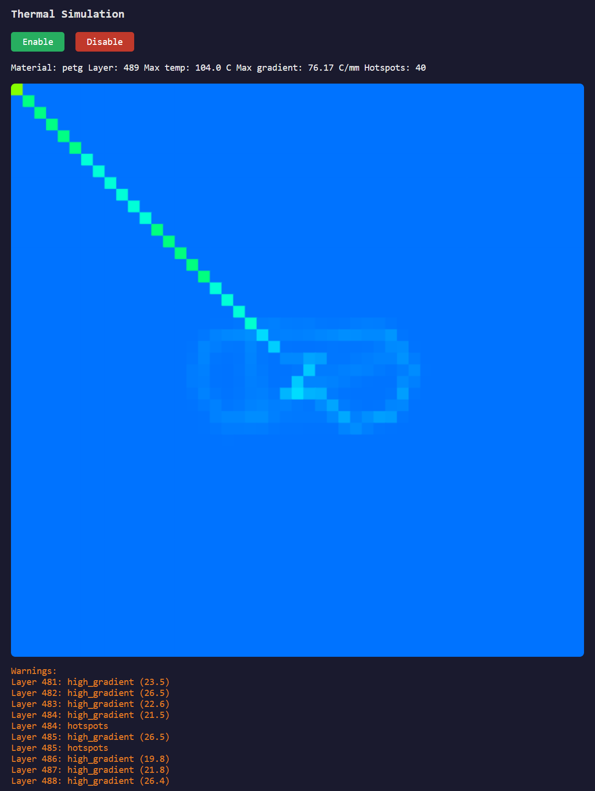

# printopt

PC-assisted print optimization for Klipper-based CoreXY 3D printers.

printopt connects to your printer via Moonraker and provides three real-time optimization plugins:

- **Vibration Analysis** — High-resolution resonance testing with custom multi-notch input shapers that outperform Klipper's built-in presets by 50-85%
- **Flow Compensation** — Predictive pressure advance, speed, and fan adjustments based on upcoming gcode geometry
- **Thermal Simulation** — Real-time 2D heat tracking with automatic fan and speed management for small features

All optimization runs on your PC — no printer modifications needed beyond standard Klipper + Moonraker.

## Requirements

**Printer:**
- Klipper firmware with Moonraker
- CoreXY kinematics (tested on Qidi Q1 Pro, should work on Voron, Ratrig, etc.)
- ADXL345 accelerometer (for vibration analysis only)
- Network connectivity (WiFi or Ethernet)

**PC:**
- Python 3.10+
- Windows, Linux, or macOS
- Optional: NVIDIA GPU with CUDA for accelerated thermal simulation

## Compatibility

### Stock Klipper (no modifications needed)

These features work on any stock Klipper + Moonraker installation:

| Feature | Stock Klipper | Notes |
|---|---|---|
| Flow compensation | Yes | Uses Moonraker HTTP API |
| Thermal simulation | Yes | Uses Moonraker HTTP API |
| Vibration analysis | Yes | Uses `TEST_RESONANCES` + SSH |
| High-res FFT (398 bins) | Yes | Analysis runs on your PC |
| 0.1Hz shaper sweep | Yes | Analysis runs on your PC |
| Preset shaper recommendations | Yes | Recommends best of zv/mzv/ei/2hump_ei/3hump_ei |
| Dashboard + live monitoring | Yes | Uses Moonraker HTTP API |
| Settings panel | Yes | All browser-based |

### Enhanced features (require Klipper fork)

These features require the [printopt Klipper fork](https://github.com/danthi123/klipper/tree/q1-pro):

| Feature | What it needs | Why |
|---|---|---|
| Custom multi-notch shapers | `custom` shaper type + 12-pulse support | Stock Klipper only supports 5 preset types with max 5 pulses |
| Multi-position vibration testing | `TEST_RESONANCES POINT=x,y,z` parameter | Stock Klipper always tests at the config's `probe_points` |

**Without the fork:** printopt still provides better vibration analysis than Klipper's built-in tools (higher resolution, finer sweep, multi-window PSD), but recommends the best preset shaper instead of a custom-optimized filter. The improvement over stock analysis is typically 10-30% better shaper selection. With the fork, custom shapers achieve 50-85% improvement.

### Installing the Klipper fork (optional)

If you want custom shaper support, you need to update three files in your Klipper installation:

```bash
# SSH into your printer
ssh root@YOUR_PRINTER_IP

# Back up originals
cp /home/mks/klipper/klippy/chelper/kin_shaper.c /home/mks/klipper/klippy/chelper/kin_shaper.c.bak
cp /home/mks/klipper/klippy/extras/input_shaper.py /home/mks/klipper/klippy/extras/input_shaper.py.bak
cp /home/mks/klipper/klippy/extras/shaper_defs.py /home/mks/klipper/klippy/extras/shaper_defs.py.bak
cp /home/mks/klipper/klippy/extras/resonance_tester.py /home/mks/klipper/klippy/extras/resonance_tester.py.bak

# Download patched files from the fork
cd /home/mks/klipper
wget -O klippy/chelper/kin_shaper.c https://raw.githubusercontent.com/danthi123/klipper/q1-pro/klippy/chelper/kin_shaper.c
wget -O klippy/extras/input_shaper.py https://raw.githubusercontent.com/danthi123/klipper/q1-pro/klippy/extras/input_shaper.py
wget -O klippy/extras/shaper_defs.py https://raw.githubusercontent.com/danthi123/klipper/q1-pro/klippy/extras/shaper_defs.py
wget -O klippy/extras/resonance_tester.py https://raw.githubusercontent.com/danthi123/klipper/q1-pro/klippy/extras/resonance_tester.py

# Recompile C helper (kin_shaper.c changed)
cd /home/mks/klipper/klippy/chelper
rm -f c_helper.so
/home/mks/klippy-env/bin/python -c "import sys; sys.path.insert(0,'..'); import chelper; chelper.get_ffi()"

# Restart Klipper
sudo systemctl restart klipper
```

To revert to stock: restore the `.bak` files, recompile c_helper.so, and restart Klipper.

**Note:** The patched files are backwards compatible — all stock shaper types still work. The only additions are the `custom` type and the `POINT=` parameter. Your existing `[input_shaper]` config doesn't need to change.

## Install

### Quick install (pip)

```bash
pip install git+https://github.com/danthi123/printopt.git
```

### With GPU support

```bash
pip install "printopt[gpu] @ git+https://github.com/danthi123/printopt.git"
```

### From source

```bash
git clone https://github.com/danthi123/printopt.git
cd printopt
pip install -e ".[dev]"
```

### SSH Setup (required for vibration analysis)

The vibration analysis plugin fetches raw accelerometer data from the printer via SSH. You need passwordless SSH key access before using it.

**Linux / macOS:**

```bash
# Generate a key if you don't have one
ssh-keygen -t ed25519 -f ~/.ssh/id_ed25519 -N ""

# Copy it to the printer (default password is usually 'makerbase' for Qidi printers)
ssh-copy-id root@192.168.0.248

# Verify it works without a password
ssh root@192.168.0.248 "echo OK"
```

**Windows:**

```powershell
# Generate a key if you don't have one
ssh-keygen -t ed25519 -f %USERPROFILE%\.ssh\id_ed25519 -N ""

# Copy the public key to the printer
# (Windows doesn't have ssh-copy-id, so do it manually)
type %USERPROFILE%\.ssh\id_ed25519.pub | ssh root@192.168.0.248 "mkdir -p ~/.ssh && cat >> ~/.ssh/authorized_keys"

# Verify it works without a password
ssh root@192.168.0.248 "echo OK"
```

If your printer uses a different username or port, adjust accordingly. The SSH connection is only used for vibration analysis — flow compensation and thermal simulation work entirely over Moonraker's HTTP API.

## Quick Start

```bash
# 1. Connect to your printer
printopt connect 192.168.0.248

# 2. Start the dashboard + all plugins
printopt run

# 3. Open http://localhost:8484 in your browser

# 4. Click "Run Analysis" on the vibration panel
#    (printer will home and vibrate for ~4 minutes)

# 5. Start a print from your slicer — flow and thermal plugins activate automatically
```

## Screenshots

### Vibration Analysis
Custom multi-notch shaper design with FFT frequency response plot:



### Flow Compensation
Real-time pressure advance and speed adjustments during printing:



### Thermal Simulation
Live toolpath temperature visualization with hotspot detection:



## Commands

| Command | Description |
|---|---|
| `printopt connect <ip>` | Connect to a printer, auto-discover config |
| `printopt connect <ip> --name myprinter` | Connect with a named profile |
| `printopt run` | Start dashboard + all plugins |
| `printopt run --printer myprinter` | Use a specific printer profile |
| `printopt run --plugins flow,thermal` | Run specific plugins only |
| `printopt run --port 8080` | Custom dashboard port |
| `printopt vibration analyze` | Run vibration analysis from CLI |
| `printopt vibration report` | View analysis results |
| `printopt vibration apply` | Apply optimized input shaper |
| `printopt profile list` | List filament profiles |
| `printopt profile create petg-custom` | Create custom filament profile |
| `printopt printer list` | List configured printers |

## Plugins

### Vibration Analysis

Captures raw ADXL345 accelerometer data at 3200Hz and runs high-resolution FFT analysis on your PC:

- **398 frequency bins** (vs Klipper's 127) using multi-window Welch's method
- **0.1Hz precision** shaper frequency sweep (vs Klipper's ~1Hz)
- **Custom multi-notch filters** designed via scipy.optimize that target your exact resonance peaks
- **Multi-position testing** across the bed to find position-dependent resonances
- Results: **50-85% less remaining vibration** compared to Klipper's best preset shapers

> **Note:** Custom shaper support requires a Klipper fork with extended pulse support (12 pulses vs stock 5). Without the fork, printopt still provides better analysis and recommends the optimal preset.

### Flow Compensation

Pre-computes a compensation schedule from your gcode at print start, then injects adjustments via Moonraker:

| Feature | Compensation |
|---|---|
| Sharp corners (>60°) | Pressure advance boost 30%, restore after |
| Bridges | Flow -5%, fan boost |
| Small perimeters (<15mm) | Speed -30% |
| Thin walls | Speed -20% |

Safety bounded: PA max 2x baseline, flow ±15%, speed ±30%. Kill switch restores all overrides instantly.

### Thermal Simulation

2D heat grid at 1mm resolution tracking real-time nozzle position:

- Material-aware thresholds (PETG Tg=78°C, ABS Tg=105°C, PLA Tg=60°C)
- Layer history (last 5 layers) catches heat accumulation on tall thin features
- Proportional fan boost (10-30%) on high thermal gradients
- Proportional speed reduction (75-95%) on hotspot accumulation
- GPU-accelerated via cupy when available, falls back to numpy

## Dashboard

Web dashboard at `http://localhost:8484` with:

- Live printer status (temperatures, position, progress) updated every second
- Per-plugin panels with real-time data
- Vibration: FFT plots with peak markers and shaper recommendations
- Flow: compensation timeline, adjustment log
- Thermal: live heatmap, gradient warnings, adjustment status
- Kill/Reset buttons for emergency override restoration

## Supported Printers

Tested on:
- Qidi Q1 Pro (CoreXY, RK3328, ADXL345)

Should work on any Klipper + Moonraker printer with CoreXY kinematics. Cartesian printers may work but are untested.

## Filament Profiles

Built-in profiles: PLA, PETG, ABS, ASA, TPU

Create custom profiles:
```bash
printopt profile create elegoo-rapid-petg
```

Profiles store thermal properties (density, specific heat, thermal conductivity, glass transition temperature) used by the thermal simulation.

## Architecture

```
Your PC                              Printer
────────                             ───────
printopt                             Klipper
├── Vibration Analysis    ←─SSH──→   ADXL345
├── Flow Compensation     ←─HTTP──→  Moonraker API
├── Thermal Simulation    ←─HTTP──→  (gcode injection)
└── Web Dashboard         ←─WS───→  (status polling)
```

- Commands sent via HTTP POST (non-blocking)
- Status polled via HTTP GET (1Hz)
- Dashboard updated via WebSocket
- Plugins run in isolated threads (one crashing doesn't affect others)

## Limitations

- **Flow compensation timing** — Progress tracking maps file position to gcode features. Accuracy depends on gcode density uniformity. Complex prints with variable density may see early/late compensations.
- **Thermal simulation is approximate** — 2D grid doesn't capture full 3D heat transfer. Heat deposition magnitude is tuned for typical geometries but may over-predict on very small features.
- **Custom shapers require fork** — The `custom` input shaper type needs our Klipper fork. Stock Klipper only supports the 5 preset types. printopt still works without the fork — it just recommends the best preset instead.
- **SSH required for vibration** — Raw ADXL345 CSV files are fetched via SSH. Your PC needs SSH key access to the printer (`ssh root@<printer-ip>` must work without a password).
- **Single-axis vibration only** — Tests X and Y independently. Diagonal resonances are not captured.

## Development

```bash
git clone https://github.com/danthi123/printopt.git
cd printopt
pip install -e ".[dev]"
pytest tests/ -q  # 182 tests
```

## License

GPLv3 — matching Klipper.
